# Bandicam的破解方法

> 有能力购买的朋友还请支持正版。

## 0x00 准备工作
* Windows 10 x64
* Bandicam 4.4.3.1557
* Bandicam注册机 v2.3.3.860

## 0x01 破解
1. 正常安装好Bandicam后断开电脑的网络连接。
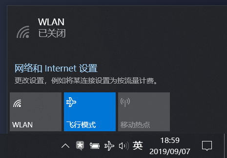

2. 右键管理员方式打开注册机，随便输入一个邮箱地址，点击【Register application!】，破解成功。

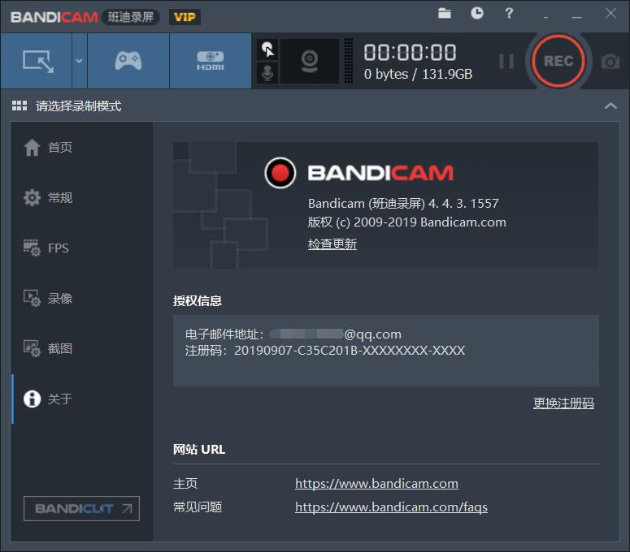

## 0x02 防止破解失效
1. 到目前为止，破解好后重新联网，再打开Bandicam有可能会出现破解失效。网上大多数教程是通过修改hosts文件来禁止Bandicam联网检查，但是这种做法番羽土啬时会失效，并且想主动访问官网时也很不方便。所以我利用防火墙规则来禁止Bandicam联网。
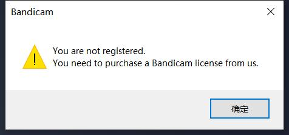
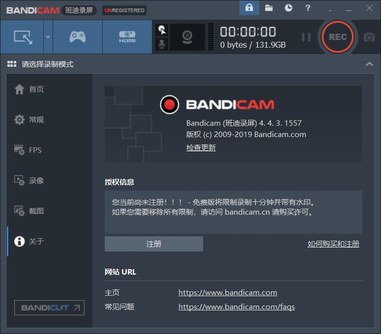

2. 打开【控制面板】中的【Windows Defender 防火墙】，点击【高级设置】。
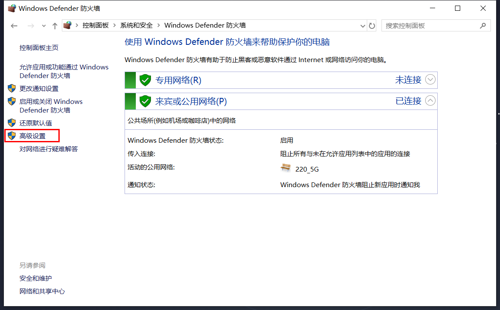

3. 新建出站规则。
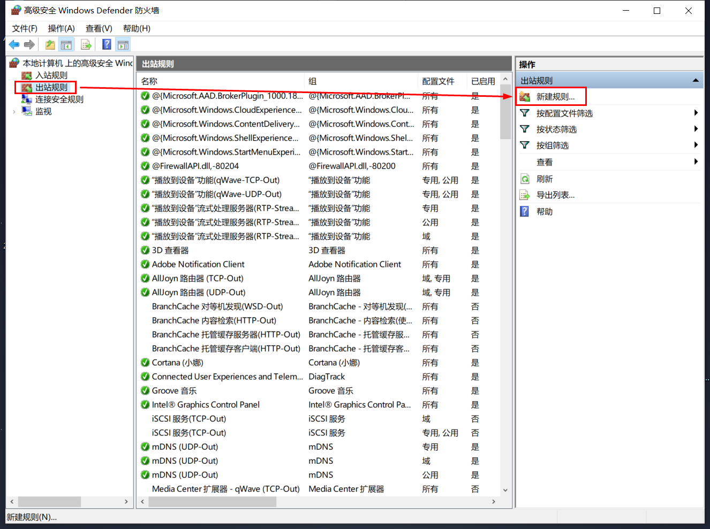

4. 规则类型选择为【程序】。
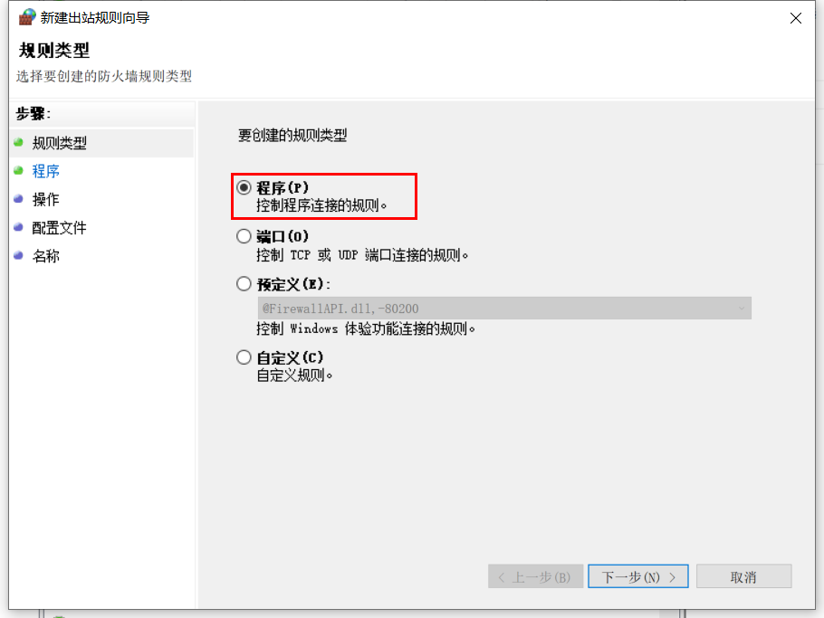

5. 输入Bandicam主程序路径。
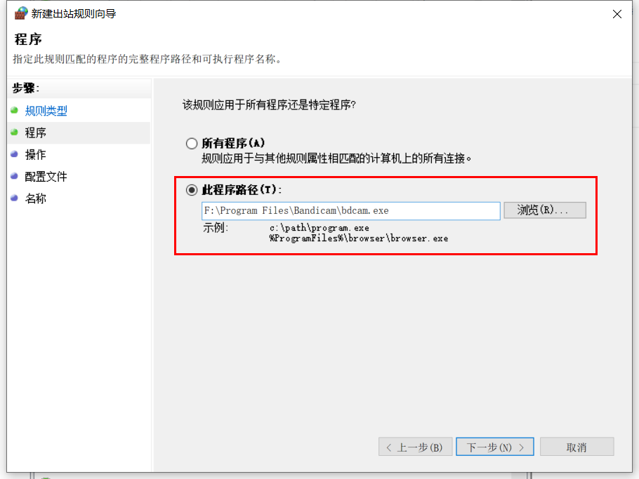

6. 操作选择为【阻止连接】。
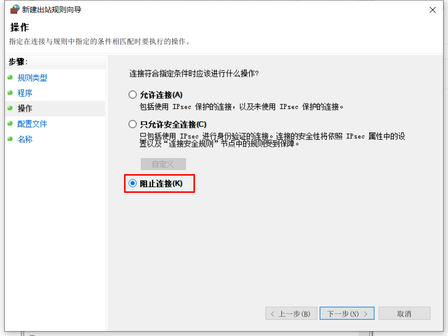

7. 在【何时应用该规则】中将三个都勾选上。
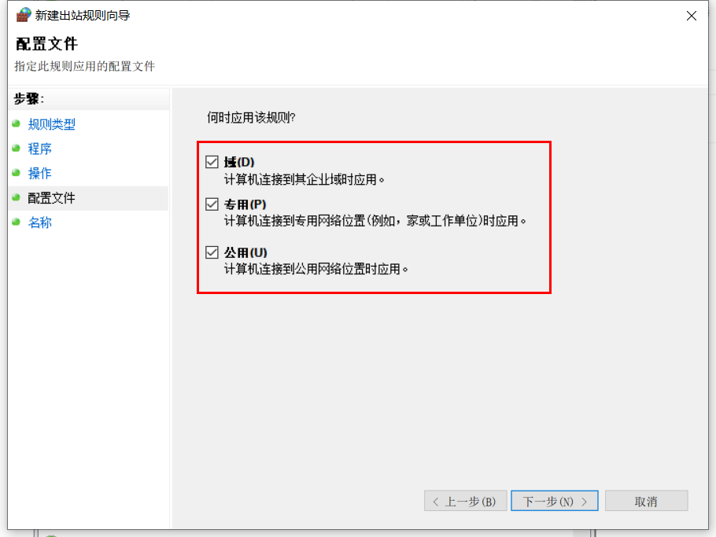

8. 输入规则名称，点击【完成】。
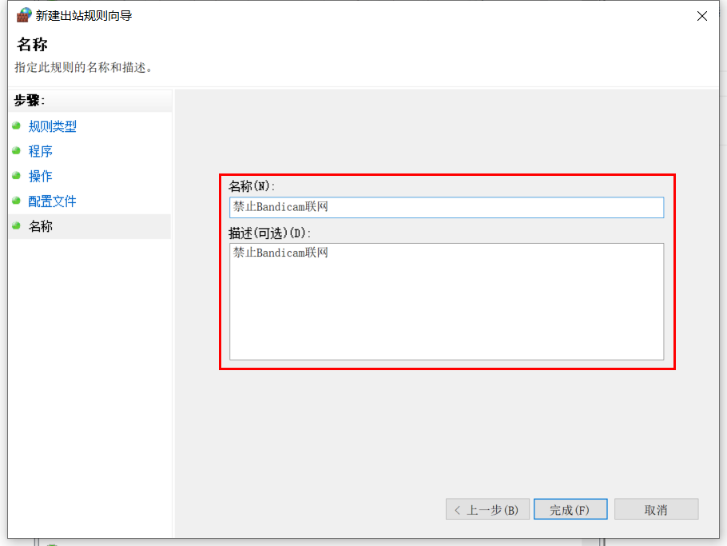

9. 因为Bandicam还有一个非管理员权限的主程序，所以也需要把这个也添加进规则。在【出站规则】列表中复制刚刚新建的规则并粘贴。
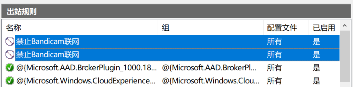

10. 双击打开其中一个规则，在【程序和服务】选项卡中修改程序的路径，选择为`bdcam_nonadmin.exe`，点击【确定】。
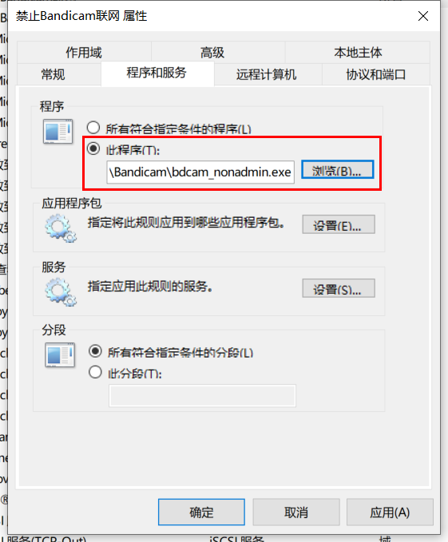

11. 用同样的方法在【入站规则】中也新建两个规则，这样就大功告成了。
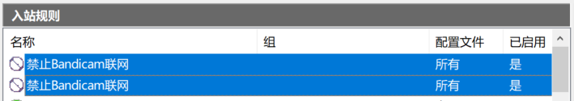

## 0x03 修复破解
1. 如果破解已经失效，断网状态下重新破解即可。
2. 如果Bandicam提示"应用程序无效"，重新安装破解即可。